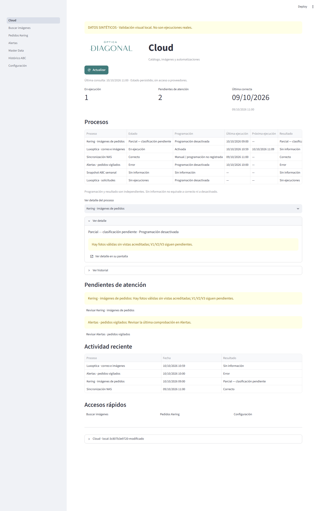
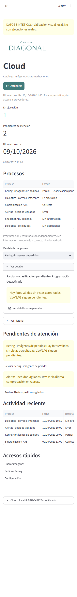

# Cloud: inicio, estados y soporte

El inicio es un lector del estado local persistido, no un disparador de trabajo.
Una consulta al entrar de verdad en la ruta y después únicamente con **Actualizar**.
Cambiar el detalle, abrir historial, navegar por la tabla o desplegar soporte no
vuelve a consultar las fuentes. Salir del inicio y volver permite otra consulta.
No hay temporizador, consultas Odoo/Graph/Kering, comprobación de imágenes,
recorrido del repositorio, ZIP ni escrituras NAS desde el inicio.

## Marca y navegación

Se reutilizan los recursos originales aportados en `logo/logo.png` y
`logo/favicon.svg`. El PNG conserva sus bytes, transparencia, colores y relación
1200:384; en la cabecera se establece exclusivamente el ancho, sin altura fija,
recorte, marco ni fondo añadido. El verde `#417B7B` procede del favicon original,
no de un color de marca inventado. Tema claro y componentes Streamlit nativos,
incluida la tabla desplazable en pantallas pequeñas.

La cabecera muestra **Cloud** y «Catálogo, imágenes y automatizaciones».
Se conservan las rutas, la autenticación y la autorización de cada pantalla.
Los administradores disponen de procesos, detalle/historial y accesos a Buscar
imágenes, Pedidos Kering y Configuración. Masterdata sólo ve las solicitudes
Luxoptica y sus accesos a Master Data/Diccionario; no obtiene fuentes ni enlaces
administrativos. No se añaden botones para ejecutar procesos: las operaciones
autorizadas siguen en sus pantallas actuales, con sus permisos y bloqueos.

## Fuentes reales y límites

| Proceso | Fuente | Interpretación y límites |
| --- | --- | --- |
| Kering | `KERING_DATA_ROOT/history.sqlite3`: runs, attempts, schedule_state; sólo bandera de configuración cifrada | Resultado agregado de intentos, cantidades de pedidos/fotos, duración y última correcta. El latido del lote acredita ejecución activa; un recibo abandonado no. Programación y resultado separados. Sin configuración legible, diagnóstico explícito, nunca credenciales. |
| Alertas de pedidos | `ORDER_ALERT_STATE_PATH`: order_alert_status | Resultado de última comprobación por origen, última correcta disponible y cantidades de envío. El latido sólo acredita vida del programador, **no una consulta/envío activo**. Esta fuente conserva los últimos estados por origen, no un historial completo ni duración. Próxima hora sólo orientativa si el intervalo/latido permiten una fecha futura. |
| Luxoptica monitor | `PROCESS_ACTIVITY_PATH`: process_runs, clave luxoptica-monitor | Recibos nuevos de las operaciones del monitor existente, estado, latido, programación registrada, siguiente fecha, cantidades y duración. No se inicia el monitor. |
| Luxoptica correo/imágenes | Mismo diario, clave luxoptica-mail | Incluye invocaciones manuales y del monitor del descargador existente; no confundirlas con la programación del monitor. |
| Luxoptica solicitudes | Mismo diario, clave luxoptica-upload | Resultado autorizado del uploader existente. Éxito de solicitud **no significa** haber recibido imágenes. |
| Sincronización NAS | Mismo diario, clave nas-sync | Sólo la réplica explícita existente registra verificación y cantidad de archivos. No hay programador NAS implementado; no se deduce uno. |
| Snapshot ABC semanal | Mismo diario, clave abc-snapshot | Operación CLI existente, productos guardados/verificados. No se consulta PostgreSQL desde el inicio ni se deduce periodicidad por el nombre. |

`PROCESS_ACTIVITY_PATH` apunta en Compose a `/app/data/process_activity.sqlite3`,
compartido por aplicación y monitor; localmente su valor por defecto es
`masterdata_data/process_activity.sqlite3`. El diario se crea **al ejecutar una
operación existente**, nunca al consultar el inicio. Lecturas SQLite con `mode=ro`
y `query_only`, consultas de historial limitadas a 20/30 entradas. Resumen de
última correcta calculado sobre historia persistida, no sólo sobre esas páginas.
No se instancian almacenes que creen tablas o recorran archivos.

Los recibos nuevos añaden latido local cada 30 segundos. Sólo un latido reciente
permite «En ejecución»; finalización registrada determina Correcto/Parcial/Error.
Si queda un recibo sin finalización ni latido reciente se informa Sin información
y se pide revisión, sin inventar progreso. Fallos de persistencia se propagan.
No se guardan mensajes de excepción, URLs, credenciales, IDs/EAN, correos o rutas
de destino en el diario: únicamente código de excepción y cantidades operativas.
No se inventa ni importa historia desde logs o listas de correos procesados.
Una fuente inexistente o sin recibos muestra **Sin información**; un almacén de
Kering vacío y configurado permite **Sin ejecuciones**. Programación desactivada
no borra ni convierte en error el último resultado.

Detalle e historial limitado son locales. Las acciones y avisos enlazan con la
pantalla correspondiente; en Alertas se muestran únicamente los últimos estados
persistidos por origen, sin prometer un historial que la fuente no conserva.

### Kering: evidencia preservada

Se conserva el commit `3c807b3` y la validación funcional **real** documentada en
[KERING_IMAGES.md](KERING_IMAGES.md): tres fotos válidas, cero vistas acreditadas,
V1/V2/V3 pendientes, repetición sin descargas y ZIP de nombres originales.
El inicio muestra **Parcial — clasificación pendiente**, no Correcto ni Error
por haber adquirido fotografías desconocidas. No se ha repetido el piloto,
activado automatización ni añadido clasificador visual. La detección automática
de vistas reales y el significado de noshad/shad siguen pendientes de evidencia.

Se mantienen la excepción Luxoptica, inventario/simulación, mapeos pendientes y
archivos no reutilizables que bloquean la migración según
[IMAGE_REPOSITORY.md](IMAGE_REPOSITORY.md). No se eliminan originales.

## Identidad del artefacto

Se retira la versión fija `1.0.6`: no existe un mecanismo de publicación semántica
mantenido que la acredite. En Docker el pie muestra `Cloud · sha-<12 caracteres>`,
procedente del commit exacto del checkout usado para construir la imagen.
El desplegable de soporte muestra commit completo, identificador de build de
Actions (`actions-<run_id>-<attempt>`) y fecha UTC de creación/publicación del
artefacto. No se afirma que esa fecha sea una publicación comercial.

`scripts/write_build_info.py` genera `build-info.json` dentro de la imagen con
los argumentos BUILD_COMMIT, BUILD_ID, BUILD_PUBLISHED y BUILD_VERSION opcional
para una versión semántica que en el futuro se configure realmente. Estos
argumentos no contienen secretos. La aplicación no usa variables de entorno para
reemplazar la identidad de una imagen ya construida.

Build local Docker requiere proporcionar commit y fecha reales y un identificador
de build; la compilación falla si faltan, en lugar de mostrar identidad ficticia.
Compose comparte esos argumentos de build entre sus cuatro servicios y no los
inyecta como identidad runtime. Por ejemplo, en PowerShell, **sólo construir**
(no arranca servicios ni despliega):

```powershell
$env:BUILD_COMMIT = (git rev-parse HEAD).Trim()
$env:BUILD_ID = "local-" + [DateTimeOffset]::UtcNow.ToUnixTimeSeconds()
$env:BUILD_PUBLISHED = [DateTime]::UtcNow.ToString("yyyy-MM-ddTHH:mm:ssZ")
docker compose build abcd-app
```

Para `docker build` directo, transmitir los mismos tres valores con `--build-arg`.
La carpeta debe representar la revisión indicada: los cambios locales no
confirmados no son una revisión verificable para un artefacto destinado a publicar.
Ejecución de código local sin artefacto muestra `local-<commit>[-modificado]` y
declara que no es una versión desplegada; sin Git ni metadatos muestra build sin
identificar. Fallos de lectura/validación se muestran explícitamente.
No existe fuente mantenida de cambios por versión: soporte lo indica.

CI aplica los mismos datos a etiquetas OCI y al JSON, carga el artefacto de PR
sin publicarlo y ejecuta importaciones de módulos de runtime con red desactivada.
Comprueba identidad JSON/etiqueta contra los datos del build y presencia del logo.
En pushes se verifica la imagen por digest; el mecanismo de despliegue existente
ya usa ese digest, no código o versión consultados al arrancar. El Dockerfile
incluye ahora módulos de imágenes que faltaban en su lista explícita COPY.
**Esta PR sólo construye/verifica: no despliega.**

## Validación y capturas

Tests con datos **sintéticos**, esquemas reales SQLite y Streamlit AppTest:
sin historial, programación desactivada, lote activo/latido antiguo, Correcto,
Parcial con clasificación pendiente y Error; claves/configuración corruptas,
fuentes inaccesibles, permisos, lectura sin escrituras y ausencia de llamadas
a proveedores/Odoo/validación de archivos. Consulta inicial, rerenders/selección,
Actualizar y reentrada contabilizados por separado. Pruebas del diario activo,
finalizado y con error sin mensajes sensibles. Identidad Docker inmutable frente
a cambios de entorno runtime y hash/dimensiones del logo original verificados.

Las siguientes capturas son un panel local alimentado exclusivamente por
fixtures **sintéticas**, marcado visiblemente. No constituyen nuevas ejecuciones
reales de proveedores ni medición de precisión del clasificador.
Anchuras verificadas 1440 y 390 px; captura vertical extendida para mostrar el
panel completo. El navegador verificó enlaces de detalle y la relación original
del logo (dimensiones naturales 1200×384, sin recodificación por Streamlit).

Validación local final: **245 tests correctos**, incluidos 18 casos nuevos del
panel/recibos/build; lint `E9,F63,F7,F82`, compilación y `git diff --check`
correctos. Persisten 16 advertencias SQLite de Python 3.12+ ya existentes.
Docker CLI no está instalado localmente; el artefacto se construye y verifica
en el CI de esta misma PR, sin publicación ni despliegue.



